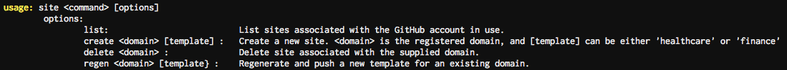

# Sphinx
Sphinx is a tool that generates faux websites for proxy categorization bypass.

## Dependencies
* [**go-git** is a highly extensible git implementation library written in pure Go.](https://github.com/src-d/go-git)
* [**go-github** is a Go client library for accessing the GitHub API v3.](https://github.com/google/go-github)

## Installation
In your `~/.gitconfig`, add the lines
```
[url "git@git.praetorianlabs.com:"]
    insteadOf = https://git.praetorianlabs.com/

```
Then run the following commands:
```
mkdir -p ~/go/src/git.praetorianlabs.com/mars
git clone git@git.praetorianlabs.com:mars/sphinx ~/go/src/git.praetorianlabs.com/mars/sphinx
go get -v git.praetorianlabs.com/mars/sphinx
```

**NOTE** If you are connected to the VPN, this will take a very long time.

## Note on Domain Registration and DNS Routing
After registering a Domain to use with Sphinx, you must configure the DNS records to point to GitHub.  The records below should be added:

| Type          | Host           | Value                    | TTL       |
| ------------- | -------------- | ------------------------ | --------- |
| A Record      | @              | 192.30.252.153           | Automatic |
| A Record      | @              | 192.30.252.154           | Automatic |
| CNAME Record  | www            | your\_registered\_domain | Automatic |

## Usage
Sphinx assumes that the user has a GitHub account thats sole purpose is to house the sites that Sphinx has generated.  This account must have a GitHub OAuth token for use with the GitHub API.

Run `~/go/bin/sphinx` to run the tool.  Sphinx will ask you for your preferred editor, GitHub username, and OAuth token.


Typing `exit` will close the tool.

The `site` command has many options it can be ran with.  Type `site help` to see those options.



* `site list` will list the current repos owned by the GitHub user currently running the tool.
* `site create` requires a <domain\> name for the site to be hosted on.  A category (either `finance` or `healthcare`) can be supplied to specify the category to generate the site as.
  * **NOTE** At the time that Sphinx was last updated, there was no way to programmatically set a github repo to be hosted as a site.  The user will need to go to the **Repo** > **Settings** > **GitHub Pages** and set the **Source** to `master branch`.
  * **NOTE** A planned update to Sphinx is to have the generated site automatically categorize itself.  This version does not do that.  Sphinx prints out the top three sites for categorization, and the user must manually categorize the sites at this time.
  * **NOTE** After the site has been generated, and the repo has been set to host it, it will take about 10 minutes for the site to show up on the domain.
* `site delete` deletes the site linked to <domain\>
* `site regen` Works the same as site create, but it will push to an existing <domain\> instead of create a new one.

## Jekyll Layout Parameters
These parameters are in the index.md files.  The index.html templates have sections where these parameters are loaded.  All of these parameters will be hard coded into templates created for their respective categories, randomly selected from a list of choices, or simply randomly generated.

* **layout** Designates the HTML Template to use
* **Images** Images will be randomly selected based on the category specified
  * **imgOne** Header image
  * **imgTwo** Left category image
  * **imgThree** Middle category image
  * **imgFour** Right category image
* **title** The string that appears on the tab of the web page
* **navTitle** The string on the left of the nav bar
* **heading** The big center words on the banner
* **subheading** The samller words on the banner
* **aboutHeading** Heading for the about section
* **Services** Services section of the site
  * **servicesHeading** Heading for the services section
  * **serviceOne** Heading for the left most service
  * **serviceOneDesc** Description for the left most service
  * **serviceTwo** Heading for the left middle service
  * **serviceTwoDesc** Description for the left middle service
  * **serviceThree** Heading for the right middle service
  * **serviceThreeDesc** Description for the right middle service
  * **serviceFour** Heading for the right most service
  * **serviceFourDesc** Description for the right most service
* **Categories** Categories section of the site
  * **categoryOne** Title on hover over the Left Service image
  * **categoryOneName** Description on hover onver the left service image 
  * **categoryTwo** Title on hover over the middle service image
  * **categoryTwoName** Description on hover over the middle service image
  * **categoryThree** Title on hover over the right service image
  * **categoryThreeName** Description on hover over right service image
* **contactDesc** Words at the top of the contact us section
* **phoneNumber** Contact phone number
* **email** Contact email address

## Template Sources
* [**Creative** is a one page creative theme for Bootstrap created by Start Bootstrap.](https://github.com/BlackrockDigital/startbootstrap-creative)
* [**Resume** is a resume and CV theme for Bootstrap created by Start Bootstrap.](https://github.com/BlackrockDigital/startbootstrap-resume)
* [**Stylish** is a stylish, one page, Bootstrap portfolio theme created by Start Bootstrap](https://github.com/BlackrockDigital/startbootstrap-stylish-portfolio)
* [**Wikipedia** is a free online encyclopedia, created and edited by volunteers around the world and hosted by the Wikimedia Foundation.](https://www.wikipedia.com)
* [**The American Board of Medical Specialties (ABMS)** works in collaboration with 24 specialty Member Boards to maintain the standards for physician certification](https://www.abms.org/member-boards/specialty-subspecialty-certificates/)
* [255 Health-care slogans](https://brandongaille.com/255-examples-catchy-healthcare-slogans-and-taglines/)
